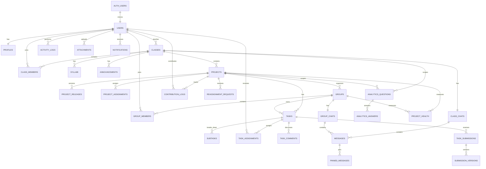

# Collabify Database Architecture

This database design targets Supabase PostgreSQL with Supabase Auth, Storage, and Realtime. Authentication identities live in `auth.users`; Collabify owns `public.users` for application roles, account state, and foreign keys.

## ERD

## Table Definitions

| Table | Purpose | Key relationships |
| --- | --- | --- |
| `users` | App-level account mirror for Supabase Auth users. | `id -> auth.users.id` |
| `profiles` | Student/professor profile details. | `user_id -> users.id` |
| `classes` | Professor-owned BSIT classes. | `professor_id -> users.id` |
| `class_members` | Enrollment and professor/student membership. | `class_id -> classes.id`, `user_id -> users.id` |
| `syllabi` | Versioned syllabus files in Supabase Storage. | `class_id -> classes.id`, `uploaded_by -> users.id` |
| `announcements` | Professor or class announcements. | `class_id -> classes.id`, `author_id -> users.id` |
| `projects` | Class project definitions and rubrics. | `class_id -> classes.id`, `created_by -> users.id` |
| `project_releases` | Versioned project specification releases. | `project_id -> projects.id` |
| `project_assignments` | Assigns projects to students or groups. | `project_id -> projects.id`, one target user or group |
| `groups` | Project/class groups. | `class_id -> classes.id`, `project_id -> projects.id` |
| `group_members` | Student group membership. | `group_id -> groups.id`, `user_id -> users.id` |
| `tasks` | Project/group task board items. | `project_id -> projects.id`, `group_id -> groups.id` |
| `subtasks` | Smaller checklist-style task items. | `task_id -> tasks.id` |
| `task_assignments` | Many-to-many task assignees. | `task_id -> tasks.id`, `assignee_id -> users.id` |
| `task_comments` | Task discussion threads. | `task_id -> tasks.id`, `author_id -> users.id` |
| `task_submissions` | Submission record for a task. | `task_id -> tasks.id`, `current_version_id -> submission_versions.id` |
| `submission_versions` | Versioned uploaded submission files. | `submission_id -> task_submissions.id` |
| `contribution_logs` | Contribution events and points. | `project_id`, `group_id`, `user_id`, optional task/submission |
| `activity_logs` | Auditable system/user events. | Optional class/project/group/entity references |
| `reassignment_requests` | Requests to move work between users/groups. | `class_id`, `project_id`, optional task and assignee/group refs |
| `class_chats` | One chat room per class. | `class_id -> classes.id` |
| `group_chats` | One chat room per group. | `group_id -> groups.id` |
| `messages` | Class/group chat messages. | Exactly one `class_chat_id` or `group_chat_id` |
| `attachments` | Generic storage metadata for supported owners. | Polymorphic `owner_type + owner_id` |
| `pinned_messages` | Class/group pinned chat messages. | `message_id -> messages.id` |
| `analytics_questions` | Professor/student analytics prompts. | Optional class/project scope |
| `analytics_answers` | AI or system answers to analytics questions. | `question_id -> analytics_questions.id` |
| `project_health` | AI/system health snapshots. | `project_id`, optional `group_id` |
| `notifications` | Per-user notification inbox. | `user_id -> users.id` |

## Relationship Notes

- `public.users` is the stable FK target for all domain tables. Supabase Auth remains the login source.
- `profiles` is one-to-one with `users`, allowing role-specific profile fields without duplicating auth data.
- A `class` belongs to one professor, while `class_members` supports many concurrent students and future co-teacher membership.
- `projects` belong to classes; `groups` can belong to a project and class, supporting project-specific teams.
- `project_assignments` supports both individual and group assignment through a constrained single-target design.
- `tasks` can be project-level or group-owned. `task_assignments` allows multiple users per task.
- `task_submissions` owns the submission lifecycle; `submission_versions` owns file version history.
- `attachments` is intentionally polymorphic so future modules can reuse storage metadata without adding a new attachment table each time.
- `messages` supports both class and group chat with a strict one-chat constraint.
- `activity_logs`, `contribution_logs`, `project_health`, and `notifications` are append-friendly tables for analytics and realtime feeds.

## Recommended Indexes

The migration includes indexes for:

- Membership checks: `class_members(class_id, user_id)`, `group_members(group_id, user_id)`.
- Dashboard loading: class, project, group, task status, due date, and created-at indexes.
- Realtime chat: `messages(class_chat_id, created_at desc)` and `messages(group_chat_id, created_at desc)`.
- Submission versioning: `submission_versions(submission_id, version desc)`.
- Analytics and health: question/project/class indexes and health snapshot indexes.
- Notification inbox: unread and chronological per-user indexes.
- Audit history: actor/class/project created-at indexes.

Add specialized composite indexes later based on slow-query evidence from Supabase Query Performance reports.

## RLS Planning

All domain tables have RLS enabled in the migration. The initial SQL includes baseline policies for users, profiles, classes, class membership visibility, syllabi, announcements, projects, groups, group members, and notifications.

Recommended production policy matrix:

| Area | Select | Insert | Update | Delete |
| --- | --- | --- | --- | --- |
| Users | Own row; service role for admin lookups | Service role after auth signup | Own limited fields; service role | Service role |
| Profiles | Own profile; same-class limited profile lookup | Own profile after signup | Own profile | Service role |
| Classes | Professor owner and active members | Professors | Owning professor | Owning professor/archive preferred |
| Class Members | Same class members | Professor owner or invite flow | Professor owner; self leave | Professor owner |
| Syllabi | Active class members | Class professor | Class professor | Class professor |
| Announcements | Active class members | Class professor | Author or class professor | Class professor |
| Projects | Active class members | Class professor | Class professor | Class professor/archive preferred |
| Groups | Class members and group members | Class professor or allowed student flow | Group leader/professor | Professor |
| Group Members | Group members and class professor | Professor or group invite flow | Professor/group leader | Professor |
| Tasks/Subtasks | Project class members, narrowed by group where applicable | Professor or project/group member | Assignee, group leader, professor | Professor or creator |
| Task Comments | Task-visible users | Task-visible users | Comment author | Comment author/professor |
| Submissions/Versions | Submitter, group members, professor | Assigned submitter/group members | Submitter until reviewed; professor review fields | Professor/service role |
| Contribution Logs | Own logs, group logs, professor | Service role or trusted backend | Service role | Service role |
| Activity Logs | Professor for owned classes; own activity | Service role/backend only | No client update | No client delete |
| Reassignment Requests | Requester, affected users, professor | Class/project members | Reviewer professor; requester cancel | Service role |
| Chats/Messages | Chat members | Chat members | Sender edit/delete soft fields | Sender/professor soft delete |
| Attachments | Visible if owner is visible | Owner-visible users | Uploader metadata only | Uploader/professor/service role |
| Analytics | Same class/project visibility | Class/project members | Service role | Service role |
| Project Health | Project class members | Service role/n8n backend | Service role/n8n backend | Service role |
| Notifications | Recipient only | Service role/backend only | Recipient read state only | Recipient/service role |

## Realtime Planning

The migration configures `replica identity full` and attempts to add these high-change tables to `supabase_realtime`:

- `messages`
- `notifications`
- `tasks`
- `subtasks`
- `task_comments`
- `task_submissions`
- `submission_versions`
- `contribution_logs`
- `project_health`
- `activity_logs`

Recommended channels:

- `class:{classId}:announcements`
- `class:{classId}:chat`
- `group:{groupId}:chat`
- `project:{projectId}:tasks`
- `project:{projectId}:health`
- `user:{userId}:notifications`

Use RLS-backed queries for initial reads, then subscribe only to the smallest channel needed for the active screen.

## Scaling Notes

- UUID primary keys keep IDs client-safe and distributed-system friendly.
- Append-heavy tables are separated from mutable domain tables to reduce write contention.
- Large files stay in Supabase Storage; database rows keep metadata and storage paths only.
- JSONB fields are reserved for evolving AI payloads, rubrics, analytics sources, risk factors, and metadata.
- Soft-state fields such as `status`, `read_at`, `deleted_at`, and `is_archived` avoid destructive deletes in user workflows.
- For very large deployments, consider monthly partitioning for `activity_logs`, `messages`, `notifications`, and `contribution_logs`.
